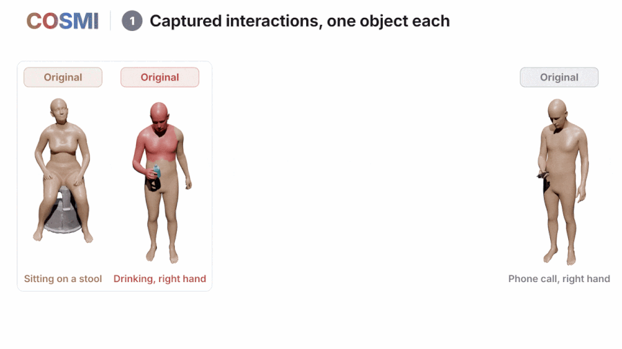

<!-- HEADER -->
<p align="center">
    <h1 align="center">COSMI: COmpositional Synthesis of Multi-object Interactions</h1>
    <!-- authors -->
    <p align="center">
        <a href="https://danieleskandar.github.io/"><b>Daniel Eskandar</b></a><sup>*</sup>
        &emsp;
        <a href="https://ptrvilya.github.io/"><b>Ilya A. Petrov</b></a><sup>*</sup>
        &emsp;
        <a href="https://virtualhumans.mpi-inf.mpg.de/people/pons-moll.html"><b>Gerard Pons-Moll</b></a>
        <br>
        <sup>*</sup>Equal contribution
    </p>
    <!-- teaser -->
    <p align="center">
        
    </p>
    <!-- badges -->
    <p align="center">
        <a href="https://arxiv.org/abs/2610.03252">
            
        </a>
        &emsp;
        <a href="https://ptrvilya.github.io/cosmi/">
            
        </a>
    </p>
</p>

COSMI composes multi-object human-object interactions from single-object captures.
The COSMI dataset holds 222k sequences and 275 hours of interactions with up to five objects,
and the COSMI method, a text-to-interaction diffusion transformer with weight-shared object slots,
generates interactions with a variable number of objects.


## Code
The code, models, and the dataset pipeline will be released soon.


## Citation
```bibtex
@article{eskandar2026cosmi,
  author  = {Eskandar, Daniel and Petrov, Ilya A. and Pons-Moll, Gerard},
  title   = {COSMI: Compositional Synthesis of Multi-Object Interactions},
  journal = {arXiv preprint arXiv:2610.03252},
  year    = {2026}
}
```
